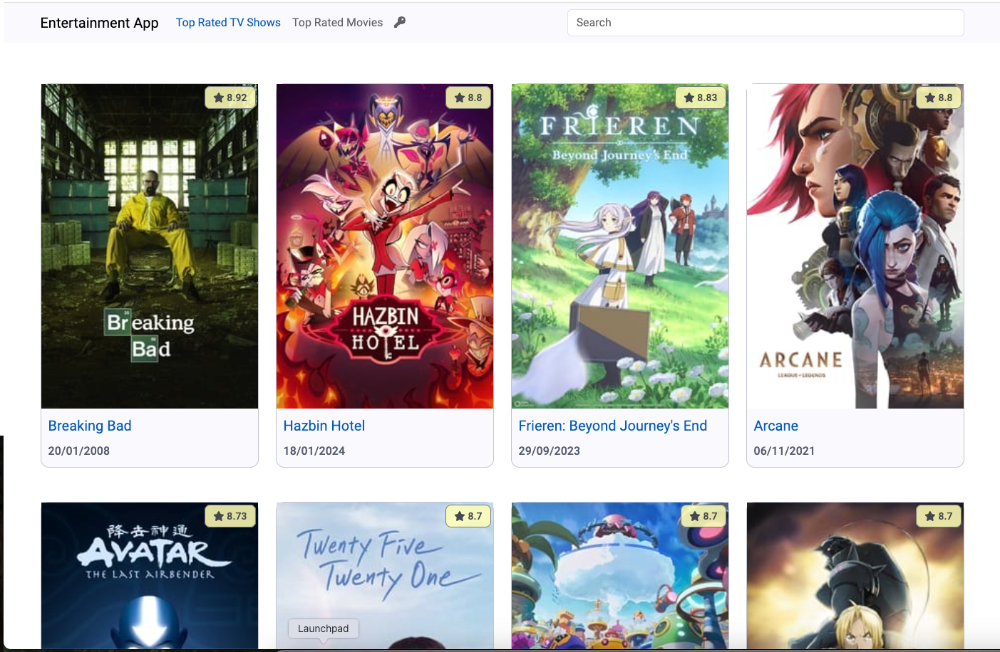

# EntertainmentApp

This project was generated using [Angular CLI](https://github.com/angular/angular-cli) version 19.0.0.

## About
This is an Angular web application that displays the top 10 rated TV shows and top 10 Movies leveraging data from The Movie Database (TMDB) API. <br />It includes a search function for both and a detailed view for individual items.
### Notes
- Responsive design
- Application is easily themed with Angular Materials (see styles.scss to change the theme)
- Style classes use SCSS with BEM syntax
- For the state management uses Angular services with RxJS
- Each page has its own route
- Makes use of RxJS operators, Angular Signals (Input and Output signals with
  computed variables) and new syntax
- Use Angular animations for route transition
- Use Angular container-presenter pattern
- Use infinite scrollable by loading new items as user reaches the bottom of the page and keeps the sorting order while new items are
  loaded
- Some default choices/numbers configurable (see app.settings.ts)

## How to run the application
Run using NodeJs v22.11.0

```bash
npm i
ng serve
```
Upon launching the application for the first time, a setup wizard will guide you through connecting the application to The Movie Database (TMDB). 

## Screenshot

